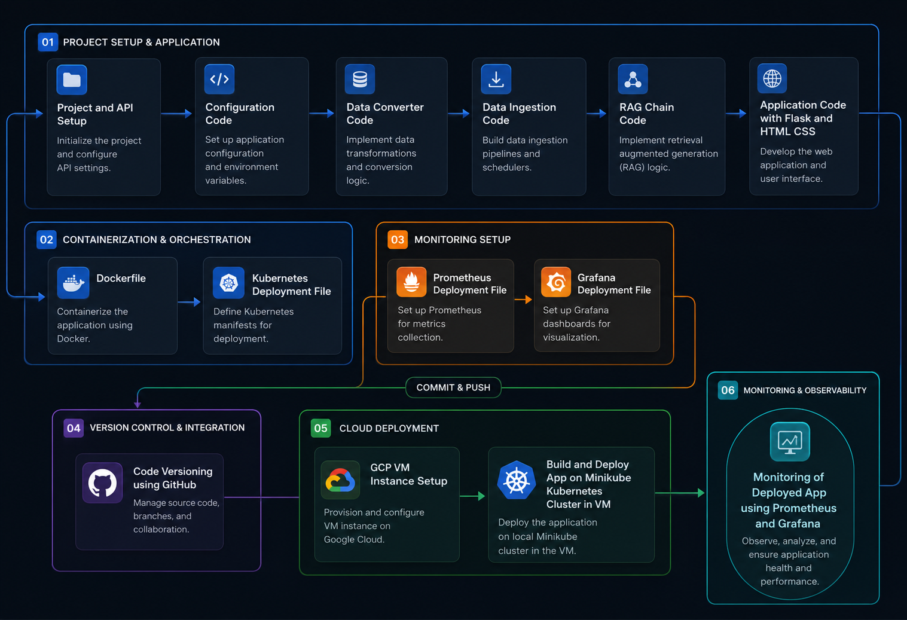

<div align="center">

# 🛒 Flipkart AI Product Recommender

### An End-to-End AI-Powered Product Recommendation System with RAG, Kubernetes & Observability

[](https://python.org)
[](https://flask.palletsprojects.com)
[](https://langchain.com)
[](https://docker.com)
[](https://kubernetes.io)
[](https://cloud.google.com)

<br/>

<p align="center">
  <em>A production-grade conversational recommendation engine that leverages Retrieval-Augmented Generation (RAG) to deliver intelligent, context-aware product suggestions powered by real Flipkart product reviews.</em>
</p>

<br/>

[Features](#-features) · [Architecture](#-architecture) · [Tech Stack](#-tech-stack) · [Getting Started](#-getting-started) · [Deployment](#-deployment) · [Monitoring](#-monitoring) · [Project Structure](#-project-structure)

---

</div>

## ✨ Features

- **🤖 Conversational AI Interface** — Natural language chat interface styled after Flipkart's design language, enabling users to ask product-related questions in plain English.
- **🔍 Semantic Product Search** — RAG pipeline performs semantic similarity search across 450+ real product reviews to surface the most relevant recommendations.
- **💬 Context-Aware Responses** — History-aware retriever maintains conversation context, enabling multi-turn follow-up queries.
- **📊 Production Monitoring** — Built-in Prometheus metrics endpoint (`/metrics`) with Grafana dashboards for real-time observability.
- **🐳 Cloud-Native Architecture** — Fully containerized with Docker, orchestrated via Kubernetes, and deployed on GCP.
- **⚡ Fast Inference** — Groq-powered LLM inference (Llama 3.1 8B) delivers sub-second response times.

---

## 🏗 Architecture

The system follows a modular, production-ready architecture spanning six key phases:

<div align="center">



</div>

### Pipeline Overview

```
User Query → Flask App → History-Aware Retriever → AstraDB Vector Store → LLM (Groq) → Response
```

| Phase | Description |
|:------|:------------|
| **01 — Project Setup & Application** | API configuration, data conversion, vector ingestion, RAG chain construction, and Flask web app development |
| **02 — Containerization & Orchestration** | Dockerized application with Kubernetes deployment manifests for scalable orchestration |
| **03 — Monitoring Setup** | Prometheus metrics collection and Grafana dashboards for application health visualization |
| **04 — Version Control** | Git-based source management with GitHub for collaboration and CI readiness |
| **05 — Cloud Deployment** | GCP VM provisioning with Minikube Kubernetes cluster for production deployment |
| **06 — Observability** | End-to-end monitoring of the deployed application using Prometheus and Grafana |

---

## 🛠 Tech Stack

<table>
<tr>
<td><b>Category</b></td>
<td><b>Technology</b></td>
<td><b>Purpose</b></td>
</tr>
<tr>
<td rowspan="2"><b>AI / ML</b></td>
<td>LangChain</td>
<td>RAG pipeline orchestration, prompt management, and chain composition</td>
</tr>
<tr>
<td>Groq (Llama 3.1 8B)</td>
<td>Ultra-fast LLM inference for generating product recommendations</td>
</tr>
<tr>
<td rowspan="2"><b>Vector Store & Embeddings</b></td>
<td>DataStax AstraDB</td>
<td>Cloud-native vector database for storing and querying product review embeddings</td>
</tr>
<tr>
<td>Hugging Face (BGE-Base-EN-v1.5)</td>
<td>Sentence embeddings for semantic representation of product reviews</td>
</tr>
<tr>
<td rowspan="3"><b>Backend</b></td>
<td>Python 3.10</td>
<td>Core programming language</td>
</tr>
<tr>
<td>Flask</td>
<td>Lightweight web framework for the conversational API</td>
</tr>
<tr>
<td>Prometheus Client</td>
<td>Application-level metrics instrumentation</td>
</tr>
<tr>
<td><b>Frontend</b></td>
<td>HTML / Tailwind CSS / jQuery</td>
<td>Responsive chat interface with Flipkart-inspired UI and markdown rendering</td>
</tr>
<tr>
<td rowspan="2"><b>DevOps</b></td>
<td>Docker</td>
<td>Application containerization for consistent environments</td>
</tr>
<tr>
<td>Kubernetes (Minikube)</td>
<td>Container orchestration, scaling, and service management</td>
</tr>
<tr>
<td rowspan="2"><b>Monitoring</b></td>
<td>Prometheus</td>
<td>Time-series metrics collection and alerting</td>
</tr>
<tr>
<td>Grafana</td>
<td>Metrics visualization and dashboard creation</td>
</tr>
<tr>
<td><b>Cloud</b></td>
<td>Google Cloud Platform</td>
<td>VM provisioning and infrastructure hosting</td>
</tr>
</table>

---

## 🚀 Getting Started

### Prerequisites

- Python 3.10+
- [Docker](https://docs.docker.com/get-docker/) (for containerized deployment)
- [kubectl](https://kubernetes.io/docs/tasks/tools/) & [Minikube](https://minikube.sigs.k8s.io/docs/start/) (for Kubernetes deployment)
- API keys for: **Groq**, **Hugging Face**, **DataStax AstraDB**

### 1. Clone the Repository

```bash
git clone https://github.com/Anand-Velpuri/Flipkart-Product-Recommender.git
cd Flipkart-Product-Recommender
```

### 2. Set Up Environment Variables

Create a `.env` file in the project root with the following variables:

```env
GROQ_API_KEY=your_groq_api_key
HF_TOKEN=your_huggingface_token
HUGGINGFACEHUB_API_TOKEN=your_huggingface_token
ASTRA_DB_API_ENDPOINT=your_astradb_api_endpoint
ASTRA_DB_APPLICATION_TOKEN=your_astradb_application_token
ASTRA_DB_KEYSPACE=default_keyspace
```

### 3. Install Dependencies

```bash
# Create and activate a virtual environment
python -m venv venv
source venv/bin/activate  # On Windows: venv\Scripts\activate

# Install the package and dependencies
pip install -e .
```

### 4. Ingest Product Data into AstraDB

> **Note:** This step is required only on first setup. It reads the CSV dataset, generates embeddings, and stores them in AstraDB.

```bash
python -m flipkart.data_ingestion
```

### 5. Run the Application

```bash
python app.py
```

The application will start on **`http://localhost:5001`**. Open it in your browser to start chatting with the AI product recommender.

---

## 🐳 Deployment

### Docker

```bash
# Build the Docker image
docker build -t flask-app:latest .

# Run the container
docker run -p 5001:5001 --env-file .env flask-app:latest
```

### Kubernetes (Minikube)

**1. Create Kubernetes secrets for sensitive environment variables:**

```bash
kubectl create secret generic llmops-secrets \
  --from-literal=GROQ_API_KEY="your_groq_api_key" \
  --from-literal=ASTRA_DB_APPLICATION_TOKEN="your_astradb_token" \
  --from-literal=ASTRA_DB_KEYSPACE="default_keyspace" \
  --from-literal=ASTRA_DB_API_ENDPOINT="your_astradb_endpoint" \
  --from-literal=HF_TOKEN="your_huggingface_token" \
  --from-literal=HUGGINGFACEHUB_API_TOKEN="your_huggingface_token"
```

**2. Deploy the Flask application:**

```bash
kubectl apply -f flask-deployment.yaml
```

**3. Deploy the monitoring stack:**

```bash
# Create the monitoring namespace
kubectl create namespace monitoring

# Deploy Prometheus
kubectl apply -f prometheus/prometheus-configmap.yaml
kubectl apply -f prometheus/prometheus-deployment.yaml

# Deploy Grafana
kubectl apply -f grafana/grafana-deployment.yaml
```

**4. Verify the deployments:**

```bash
kubectl get pods
kubectl get services
kubectl get pods -n monitoring
```

---

## 📊 Monitoring

The application exposes a `/metrics` endpoint that Prometheus scrapes at a configurable interval (default: 15s).

| Service | Port | Access (NodePort) |
|:--------|:-----|:-------------------|
| **Flask App** | `5001` | LoadBalancer → port `80` |
| **Prometheus** | `9090` | NodePort `32001` |
| **Grafana** | `3000` | NodePort `32000` |

### Available Metrics

| Metric | Type | Description |
|:-------|:-----|:------------|
| `http_requests_total` | Counter | Total number of HTTP requests to the home page |

### Setting Up Grafana

1. Access Grafana at `http://<node-ip>:32000`
2. Add Prometheus as a data source (`http://prometheus-service.monitoring:9090`)
3. Import or create dashboards to visualize `http_requests_total` and system metrics

---

## 📁 Project Structure

```
Flipkart-Product-Recommender/
│
├── app.py                          # Flask application entry point
├── setup.py                        # Package configuration and dependency management
├── requirements.txt                # Python dependencies
├── Dockerfile                      # Container image definition
├── .env                            # Environment variables (API keys — not committed)
├── .dockerignore                   # Docker build exclusions
├── .gitignore                      # Git tracking exclusions
│
├── flipkart/                       # Core application package
│   ├── __init__.py
│   ├── config.py                   # Centralized configuration (API keys, model names)
│   ├── data_converter.py           # CSV → LangChain Document transformation
│   ├── data_ingestion.py           # Vector store initialization and data loading
│   └── rag_chain.py                # RAG chain with history-aware retrieval
│
├── utils/                          # Utility modules
│   ├── __init__.py
│   ├── logger.py                   # Structured logging configuration
│   └── custom_exception.py         # Detailed exception handling with file/line info
│
├── data/
│   └── flipkart_product_review.csv # Source dataset (450+ product reviews)
│
├── templates/
│   └── index.html                  # Chat UI (Tailwind CSS + jQuery + Marked.js)
│
├── flask-deployment.yaml           # K8s Deployment + Service for the Flask app
│
├── prometheus/
│   ├── prometheus-configmap.yaml   # Prometheus scrape configuration
│   └── prometheus-deployment.yaml  # K8s Deployment + Service for Prometheus
│
├── grafana/
│   └── grafana-deployment.yaml     # K8s Deployment + Service for Grafana
│
└── images/
    └── flipkart_product_recommender_structure.png  # Architecture diagram
```

---

## ⚙️ How It Works

### 1. Data Ingestion
The [`DataConverter`](flipkart/data_converter.py) reads the Flipkart product review CSV and transforms each row into a LangChain `Document` with the review as content and product title as metadata. The [`DataIngestion`](flipkart/data_ingestion.py) class generates embeddings using **BGE-Base-EN-v1.5** via the Hugging Face Inference API and stores them in **AstraDB**.

### 2. RAG Chain
The [`RAGChainBuilder`](flipkart/rag_chain.py) constructs a two-stage retrieval chain:
- **History-Aware Retriever** — Rewrites user queries using conversation history to form standalone questions, then performs semantic search (top-3 results) against the vector store.
- **QA Chain** — Feeds retrieved context into **Llama 3.1 8B** (via Groq) with a system prompt tailored for e-commerce product recommendations.
- **Message History** — Wraps the chain with `RunnableWithMessageHistory` for multi-turn conversation support.

### 3. Web Interface
The [Flask app](app.py) serves a responsive chat interface built with Tailwind CSS. User messages are sent via AJAX to the `/get` endpoint, which invokes the RAG chain and returns markdown-formatted responses rendered client-side with **Marked.js**.

---

## 🤝 Contributing

Contributions are welcome! Feel free to open issues or submit pull requests.

1. Fork the repository
2. Create a feature branch (`git checkout -b feature/your-feature`)
3. Commit your changes (`git commit -m 'Add your feature'`)
4. Push to the branch (`git push origin feature/your-feature`)
5. Open a Pull Request

---

## 📬 Contact

**Anand Velpuri** — [velpurianand8005@gmail.com](mailto:velpurianand8005@gmail.com)

**Project Link:** [https://github.com/Anand-Velpuri/Flipkart-Product-Recommender](https://github.com/Anand-Velpuri/Flipkart-Product-Recommender)

---

<div align="center">

⭐ **If you found this project useful, consider giving it a star!** ⭐

</div>

